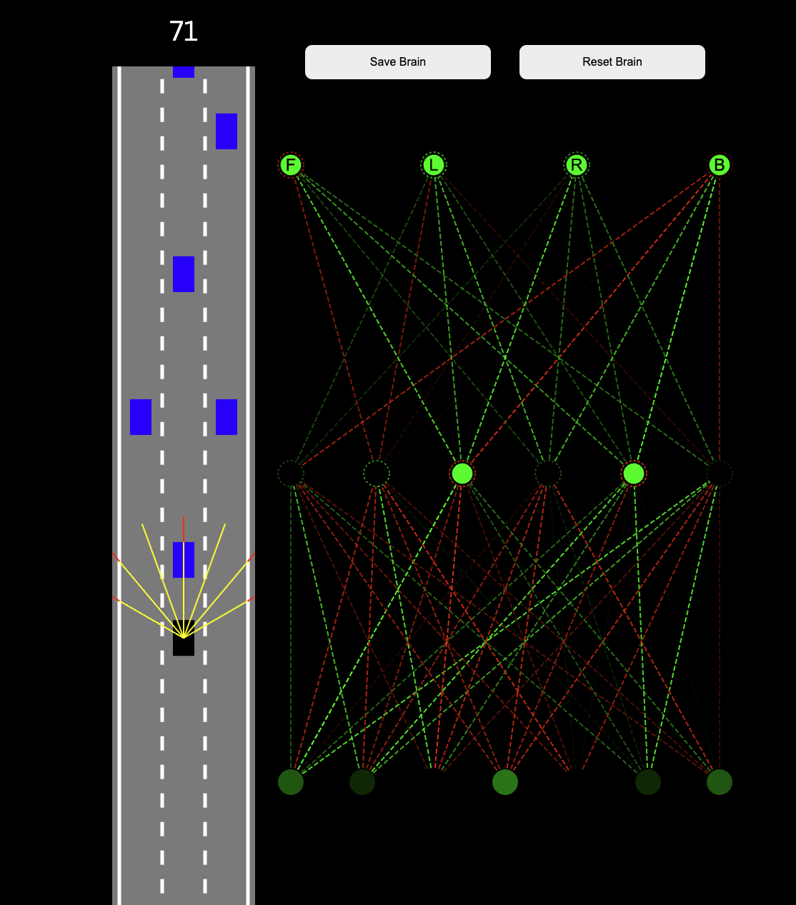

## Self-driving car using simple neural network

Starts with randomly generated brain (weight & bias), save the best brain, refresh, train the brain until you dodge all the obstacles

## Getting Started

- Open index.html
    - Define N amount of cars in main.js - const N, starts with 1000
    - Weight & bias randomly generated at start
    - Use "Save Brain" to save the furthest driven cars weight & bias to localStorage
        - New weight is randomised with 10% difference to the saved brain
    - Use "Reset Brain" to reset the best cars weight & bias

